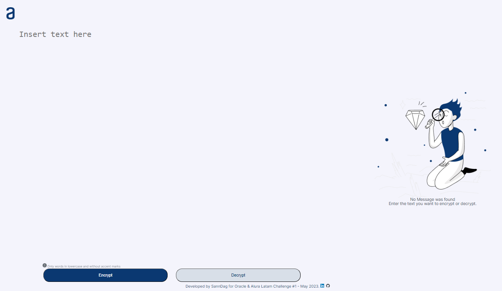
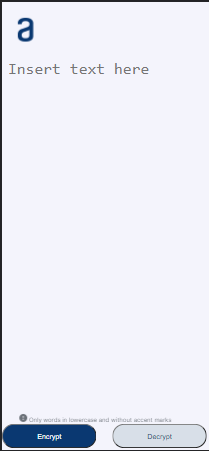
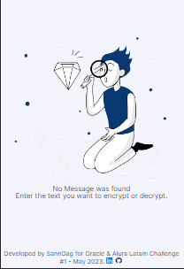

    
    
    

 
 
<h1>🔒Text Encrypter</h1>
 
To test the app, please click on the link:
https://sanndag.github.io/text-encrypter-challenge/

Preview:

**Desktop**

**Mobile**
 

 

 
 

# 📖Requested features

The encryption keys that were used are as follows:

- The letter **"e"** is converted to **"enter"**.
- The letter **"i"** is converted to **"imes"**. 
- The letter **"a"** is converted to **"ai"**.
- The letter **"o"** is converted to **"ober"**.
- The letter **"u"** is converted to **"ufat"**.  

# ❗Requirements

- The app must have one area for user input text and another area to display that text encrypted or decrypted.
- Cannot enter capital letters or accent marks.
- It must display the message on the screen.
- (optional) Add a button to copy text.

 

*Developed by SannDag for ONE Oracle Next Education & Alura Latam - Challenge #1 - May 2023.*

